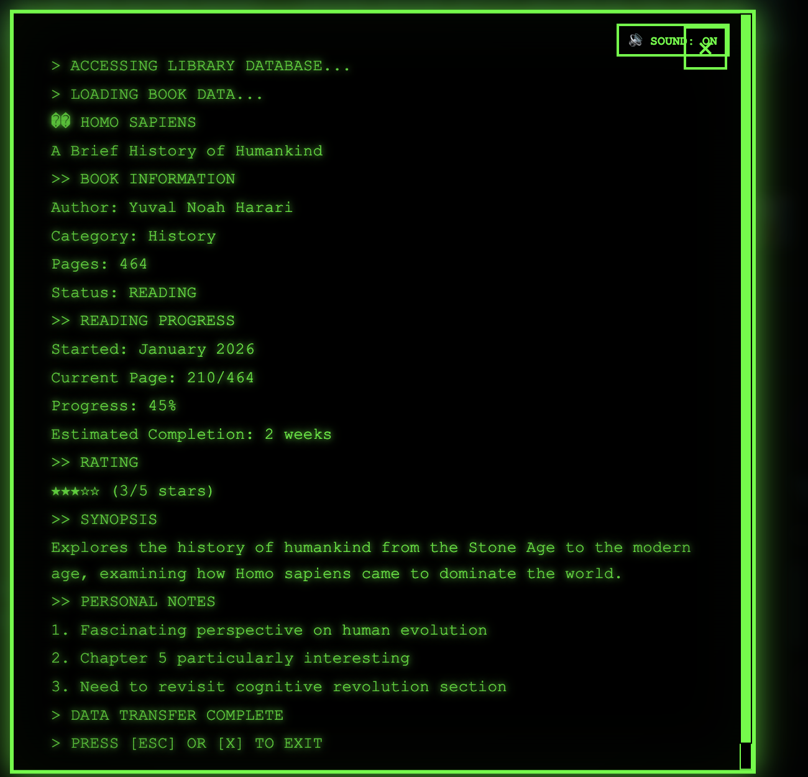
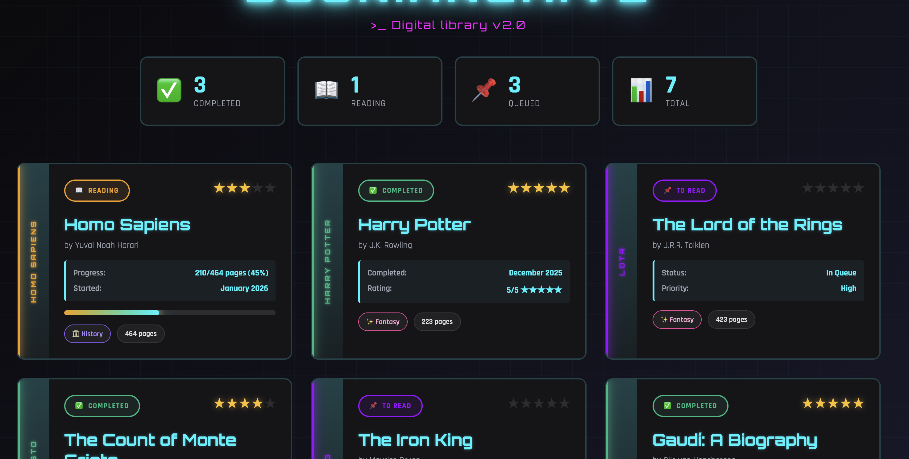

# 📚 Cyberpunk Book Tracker

<div align="center">


A futuristic book tracking system with neon-cyberpunk aesthetics, Fallout 3-style terminal interface, and typewriter sound effects.

[🌐 Live Demo](https://book-archive.laddtnov.xyz/)


</div>

---

## ✨ Features

- **📖 Smart Book Cards** - Neon-glowing spines with status colors
- **💚 Fallout Terminal** - Click any book for detailed terminal view with typewriter effect
- **🔊 Typewriter Sounds** - Authentic typing sounds via Web Audio API
- **📊 Stats Dashboard** - Real-time reading statistics
- **⚡ Animated Progress** - Live progress bars for books in progress
- **🎨 Cyberpunk Design** - Neon cyan, pink, purple aesthetics
- **📱 Fully Responsive** - Mobile, tablet, desktop optimized

---

## 🚀 Quick Start

```bash
git clone https://github.com/laddtnov/cyberpunk-book-tracker.git
cd cyberpunk-book-tracker
open index.html
```

**Click on any book card to access the terminal!** 💚

---

## 🎮 How It Works

1. **Browse books** in the cyberpunk-styled grid
2. **Click a book card** to open the Fallout 3 terminal
3. **Watch text type out** with authentic typewriter sounds
4. **Read detailed info** - synopsis, notes, progress, ratings
5. **Close with ESC** or the X button

---

## 📊 Book Statuses

| Status | Color | Glow |
|--------|-------|------|
| 📖 **Reading** | Orange | Animated pulse |
| ✅ **Completed** | Green | Steady glow |
| 📌 **To Read** | Purple | Soft glow |

---

## 🎨 Customization

### Add New Books

Edit `script.js`:

```javascript
"your-book": {
  title: "Your Book Title",
  author: "Author Name",
  category: "Genre",
  pages: 300,
  status: "to-read",
  synopsis: "Description...",
  notes: ["Note 1", "Note 2"]
}
```

### Change Colors

Edit `styles.css`:

```css
:root {
  --neon-cyan: #00f2ff;
  --neon-pink: #ff00ff;
  --neon-purple: #9d00ff;
}
```

---

## 🛠️ Tech Stack

- **HTML5** - Semantic structure
- **CSS3** - Grid, Flexbox, Animations, Variables
- **JavaScript ES6+** - Web Audio API, Async/Await
- **Zero Dependencies** - Pure vanilla code

---

## 📱 Responsive

- **Desktop:** Full 3-4 column grid
- **Tablet:** 2-3 columns, optimized spacing
- **Mobile:** Single column, touch-friendly

---

## 📬 Contact

**Laddtnov**
- GitHub: [@laddtnov](https://github.com/laddtnov)
- Email: novytskiyvladislav@proton.me
- Portfolio: [laddtnov.github.io/portfolio-website](https://laddtnov.github.io/portfolio-website/)

---

## 🌠 More Projects

**Cyberpunk Portfolio Collection:**

1. [🌌 Interactive Solar System](https://github.com/laddtnov/interactive-solar-system)
2. [💼 Cyberpunk Portfolio](https://github.com/laddtnov/portfolio-website)
3. [📚 Book Tracker](https://github.com/laddtnov/cyberpunk-book-tracker) - This project

---

<div align="center">

**Made with ❤️ using HTML, CSS, and JavaScript**

**If you like this project, give it a ⭐!**

</div>
